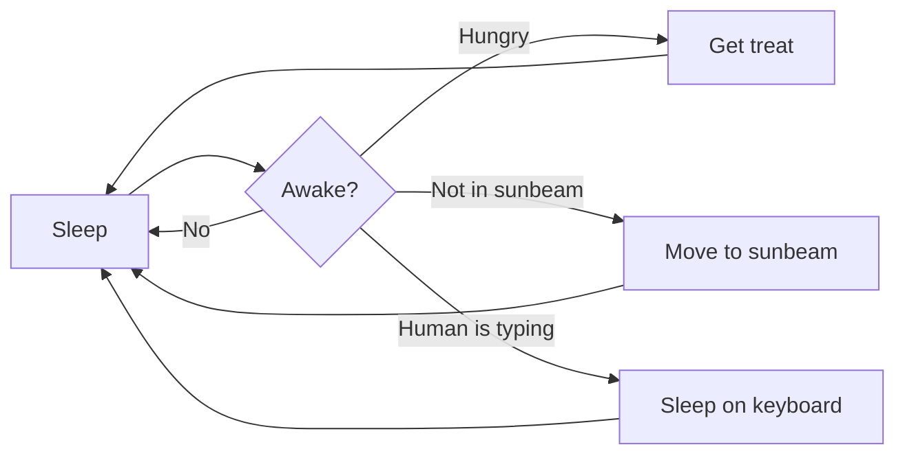

# Markdown 与 Visual Studio Code

在 Visual Studio Code 中处理 Markdown 文件简单、直接且有趣。除了 VS Code 的基本编辑功能外，还有一些专为 Markdown 设计的功能，可帮助你提高工作效率。

>**注意**：为了帮助你快速上手编辑 Markdown 文件，你可以使用 [Doc Writer 配置文件模板](/docs/configure/profiles.md#doc-writer-profile-template) 来安装有用的扩展（拼写检查器、Markdown 代码检查器）并配置合适的设置值。

## 编辑 Markdown

### 文档大纲

大纲视图是文件资源管理器底部的一个独立区域。展开后，它会显示当前活动编辑器的符号树。对于 Markdown 文件，符号树就是 Markdown 文件的标题层级结构。


大纲视图是查看文档标题结构和概要的绝佳方式。

### Markdown 代码片段

VS Code 包含一些有用的代码片段，可以加速 Markdown 的编写。其中包括代码块、图片等代码片段。在编辑时按 `kb(editor.action.triggerSuggest)`（触发建议）可查看建议的 Markdown 代码片段列表。你也可以使用专用的代码片段选择器，在命令面板中选择**插入代码片段**。

>**提示：** 你可以为自己的 Markdown 添加用户自定义代码片段。请参阅[用户自定义代码片段](/docs/editing/userdefinedsnippets.md)了解具体方法。

### 跳转到文件中的标题

使用 `kb(workbench.action.gotoSymbol)` 可快速跳转到当前文件中的标题。


你可以浏览文件中的所有标题，或者开始输入标题名称以找到你想要的那个。找到目标标题后，按 `kbstyle(Enter)` 将光标移动到该标题处。按 `kbstyle(Esc)` 取消跳转到标题。

### 跳转到工作区中的标题

使用 `kb(workbench.action.showAllSymbols)` 可搜索当前工作区中所有 Markdown 文件内的标题。


开始输入标题名称以筛选列表，找到你想要的标题。

### 路径补全

路径补全功能可帮助你创建指向文件和图片的链接。当你输入图片或链接的路径时，这些路径会自动由 [IntelliSense](/docs/editing/intellisense.md) 显示，也可以通过使用 `kb(editor.action.triggerSuggest)` 手动请求。


以 `/` 开头的路径将相对于当前工作区根目录解析，而以 `./` 开头或无任何前缀的路径则相对于当前文件解析。当你输入 `/` 时，路径建议会自动显示，也可以通过使用 `kb(editor.action.triggerSuggest)` 手动调用。

路径 IntelliSense 还可以帮助你链接到当前文件或另一个 Markdown 文件中的标题。以 `#` 开头路径可查看文件中所有标题的补全建议（根据你的设置，可能需要使用 `kb(editor.action.triggerSuggest)` 才能看到这些建议）：


你可以通过 `"markdown.suggest.paths.enabled": false` 禁用路径 IntelliSense。

### 创建指向其他文件中标题的链接

需要链接到另一个 Markdown 文档中的标题，但又不想输入完整文件路径或记不住？试试工作区标题补全功能！首先，在 Markdown 链接中输入 `##` 即可查看当前工作区中所有 Markdown 标题的列表：


接受其中一个补全项可插入指向该标题的完整链接，即使该标题在另一个文件中：


你可以通过 `setting(markdown.suggest.paths.includeWorkspaceHeaderCompletions)` 设置来配置是否显示以及何时显示工作区标题补全。有效的设置值包括：

* `onDoubleHash`（默认值）——仅在输入 `##` 后显示工作区标题补全。
* `onSingleOrDoubleHash`——在输入 `#` 或 `##` 后显示工作区标题补全。
* `never`——从不显示工作区标题补全。

请注意，查找当前工作区中的所有标题可能开销较大，因此在首次请求时可能会有轻微延迟，尤其对于包含大量 Markdown 文件的工作区而言。

### 插入图片和文件链接

除了[路径补全](#路径补全)之外，VS Code 还支持其他几种将图片和文件链接插入到 Markdown 文档中的方式：

你可以**拖放**文件，从 VS Code 的资源管理器或操作系统中将文件拖放到 Markdown 编辑器中。首先从 VS Code 资源管理器中拖出一个文件到你的 Markdown 代码上方，然后按住 `kbstyle(Shift)` 开始将文件放入其中。预览光标会显示放下文件时插入的位置。


如果你更喜欢使用键盘，也可以**复制并粘贴**文件或图片数据到 Markdown 编辑器中。当你粘贴一个文件、文件链接或 URL 时，你可以选择插入 Markdown 链接或将链接作为纯文本包含。


或者你可以使用 **Markdown：从工作区插入图片** 命令来插入图片，以及使用 **Markdown：插入指向工作区中文件的链接** 命令来插入文件链接。

插入的图片使用 Markdown 图片语法 ``。链接则插入普通的 Markdown 链接 `[](path/to/file.md)`。

默认情况下，VS Code 会自动将工作区外拖放或粘贴的图片复制到你的工作区中。`setting(markdown.copyFiles.destination)` 设置控制新图片文件的创建位置。此设置将匹配当前 Markdown 文档的 [glob 模式](/docs/editor/glob-patterns.md)映射到目标图片位置。目标图片位置还可以使用一些简单的变量。有关可用变量的信息，请参阅 `setting(markdown.copyFiles.destination)` 的设置描述。

例如，如果你希望工作区中 `/docs` 下的每个 Markdown 文件将新的媒体文件放入该文件专属的 `images` 目录中，可以这样配置：

```jsonc
"markdown.copyFiles.destination": {
  "/docs/**/*": "images/${documentBaseName}/"
}
```

现在，当在 `/docs/api/readme.md` 中粘贴一个新文件时，图片文件会创建在 `/docs/api/images/readme/image.png`。

你甚至可以使用简单的正则表达式来转换变量，[类似于代码片段的变量转换方式](/docs/editing/userdefinedsnippets.md#variable-transforms)。例如，此转换在创建媒体文件时仅使用文档文件名的首字母：

```jsonc
"markdown.copyFiles.destination": {
  "/docs/**/*": "images/${documentBaseName/(.).*/$1/}/"
}
```

当在 `/docs/api/readme.md` 中粘贴一个新文件时，图片现在会创建在 `/docs/api/images/r/image.png`。

### 为图片生成替代文本

你可以使用 AI 来为 Markdown 文件中的图片生成或更新替代文本（alt text）。生成替代文本的步骤：

1. 确保你已在 VS Code 环境中[设置 Copilot](/docs/setup/copilot.md)。你可以免费开始使用 Copilot。

1. 打开一个 Markdown 文件。
1. 将光标放在图片链接上。
1. 选择"代码操作"（灯泡）图标，然后选择**生成替代文本**。

    

1. 如果你已经有替代文本，选择"代码操作"，然后选择**优化替代文本**。

### 智能选择

智能选择功能让你可以快速在 Markdown 文档中扩展和收缩选择范围。这可用于快速选择整个块级元素（如代码块或表格），以及选择 Markdown 文件中某个标题部分的全部内容。

智能选择使用以下命令：

* 扩展：`kb(editor.action.smartSelect.expand)`
* 收缩：`kb(editor.action.smartSelect.shrink)`

选择适用于以下元素，并遵循传统的层级模式：

* 标题
* 列表
* 块引用
* 围栏代码块
* HTML 代码块
* 段落


### 链接验证

链接验证会检查 Markdown 代码中的本地链接，以确保它们有效。这可以发现常见错误，例如链接到已被重命名的标题或磁盘上不再存在的文件。


链接验证默认情况下处于关闭状态。要启用它，请设置 `"markdown.validate.enabled": true`。VS Code 随后会分析指向标题、图片和其他本地文件的 Markdown 链接。无效链接会以警告或错误的形式报告。所有链接验证均在本地进行，不会检查外部的 http(s) 链接。

你可以使用以下几个设置来自定义链接验证：

* `setting(markdown.validate.fileLinks.enabled)` ——启用/禁用对本地文件的链接验证：`[link](/path/to/file.md)`
* `setting(markdown.validate.fragmentLinks.enabled)` ——启用/禁用对当前文件中标题的链接验证：`[link](#some-header)`
* `setting(markdown.validate.fileLinks.markdownFragmentLinks)` ——启用/禁用对其他 Markdown 文件中标题的链接验证：`[link](other-file.md#some-header)`
* `setting(markdown.validate.referenceLinks.enabled)` ——启用/禁用对引用链接的验证：`[link][ref]`。
* `setting(markdown.validate.ignoredLinks)` ——一个跳过验证的链接 glob 模式列表。当你链接到磁盘上不存在但 Markdown 发布后确实存在的文件时，这很有用。

### 查找标题和链接的所有引用

使用**查找所有引用**（`kb(references-view.findReferences)`）命令可查找当前工作区中引用某个 Markdown 标题或链接的所有位置：


**查找所有引用**支持以下场景：

* 标题：`# My Header`。显示所有指向 `#my-header` 的链接。
* 外部链接：`[text](http://example.com)`。显示所有指向 `http://example.com` 的链接。
* 内部链接：`[text](./path/to/file.md)`。显示所有指向 `./path/to/file.md` 的链接。
* 链接中的片段：`[text](./path/to/file.md#my-header)`。显示所有指向 `./path/to/file.md` 中 `#my-header` 的链接。

### 重命名标题和链接

每次修改 Markdown 标题时担心意外破坏链接？试试使用**重命名符号**（`kb(editor.action.rename)`）来代替。输入新标题名称并按 `kbstyle(Enter)` 后，VS Code 会更新标题并自动更新所有指向该标题的链接：


你也可以对以下内容使用 `kb(editor.action.rename)`：

* 标题：`# My Header`。这会更新所有指向 `#my-header` 的链接。
* 外部链接：`[text](http://example.com/page)`。这会更新所有链接到 `http://example.com/page` 的位置。
* 内部链接：`[text](./path/to/file.md)`。这会重命名文件 `./path/to/file.md` 并更新所有指向它的链接。
* 链接中的片段：`[text](./path/to/file.md#my-header)`。这会重命名 `./path/to/file.md` 中的标题并更新所有指向它的链接。

### 文件移动或重命名时自动更新链接

通过自动 Markdown 链接更新功能，VS Code 会在被链接的文件被移动或重命名时自动更新 Markdown 链接。你可以通过 `setting(markdown.updateLinksOnFileMove.enabled)` 设置来启用此功能。有效的设置值包括：

* `never`（默认值）——不尝试自动更新链接。
* `prompt`——在更新链接前询问确认。
* `always`——自动更新链接，无需确认。

自动链接更新会检测 Markdown 文件、图片和目录的重命名。你可以通过 `setting(markdown.updateLinksOnFileMove.include)` 为其他文件类型启用此功能。

## Markdown 预览

VS Code 开箱即支持 Markdown 文件。你只需开始编写 Markdown 文本，以 `.md` 扩展名保存文件，然后就可以在代码视图和 Markdown 文件的预览之间切换可视化效果；显然，你也可以打开一个已有的 Markdown 文件并开始处理它。要在视图之间切换，在编辑器中按 `kb(markdown.togglePreview)`。你可以并排查看预览 `kb(markdown.showPreviewToSide)`，并在编辑时实时查看更改的反映。

以下是一个简单文件的示例。


>**提示：** 你也可以右键单击编辑器标签页并选择**打开预览**（`kb(markdown.togglePreview)`），或使用**命令面板**（`kb(workbench.action.showCommands)`）运行 **Markdown：在侧边打开预览** 命令（`kb(markdown.showPreviewToSide)`）。

### 动态预览与预览锁定

默认情况下，Markdown 预览会自动更新以预览当前活动的 Markdown 文件：


你可以使用 **Markdown：切换预览锁定** 命令锁定 Markdown 预览，使其保持对当前 Markdown 文档的预览。锁定的预览在标题栏中会显示 **\[预览]** 标识：


>**注意：** **Markdown：切换预览锁定** 命令仅在 Markdown 预览是活动标签页时才可用。

### 编辑器与预览同步

VS Code 会自动同步 Markdown 编辑器和预览窗格。滚动 Markdown 预览时，编辑器会相应滚动以匹配预览的视口。滚动 Markdown 编辑器时，预览也会相应滚动以匹配其视口：


你可以使用 `setting(markdown.preview.scrollPreviewWithEditor)` 和 `setting(markdown.preview.scrollEditorWithPreview)` [设置](/docs/configure/settings.md)来禁用滚动同步。

编辑器中当前选中的行会在 Markdown 预览的左侧边距中以浅灰色条标注：


此外，在 Markdown 预览中双击某个元素时，会自动打开该文件的编辑器并滚动到距离所点击元素最近的行。


### 差异视图中的 Markdown 预览

Markdown 预览还可以渲染差异，显示带有高亮更改的渲染文档，而非原始 Markdown 源码。

此行为需要主动选择启用。你可以将单个差异切换到预览，或者更改用于 Markdown 差异的默认编辑器。

#### 在 Markdown 预览中打开单个差异

要将打开的 Markdown 差异（例如从**源代码管理**视图中打开的文件）切换到渲染后的预览：

1. 在差异编辑器处于活动状态时，从命令面板（`kb(workbench.action.showCommands)`）运行 **查看：使用...重新打开编辑器**。
1. 选择 **Markdown 预览**。

要切换回来，再次运行 **查看：使用...重新打开编辑器** 并选择默认的文本编辑器。

#### 将 Markdown 预览设为默认编辑器

要将 Markdown 预览设为所有 `.md` 文件（包括差异）的默认编辑器，请配置 `setting(workbench.editorAssociations)` 设置：

```json
"workbench.editorAssociations": {
    "*.md": "vscode.markdown.preview.editor"
}
```

使用此设置后，从资源管理器打开 Markdown 文件或从源代码管理打开 Markdown 差异时，默认都将显示渲染后的预览。你仍然可以使用 **查看：使用...重新打开编辑器** 将单个编辑器切换回文本视图。

#### 仅对差异使用 Markdown 预览

要仅在差异中在预览中渲染 Markdown，而普通文件打开时仍使用文本编辑器，请使用 `setting(workbench.diffEditorAssociations)` 设置：

```json
"workbench.diffEditorAssociations": {
    "*.md": "vscode.markdown.preview.editor"
}
```

对于差异视图，`workbench.diffEditorAssociations` 优先于 `workbench.editorAssociations`。你可以结合这两个设置，使预览成为普通文件打开的默认方式，同时让差异保持在文本编辑器中：

```json
"workbench.editorAssociations": {
    "*.md": "vscode.markdown.preview.editor"
},
"workbench.diffEditorAssociations": {
    "*.md": "default"
}
```

#### 内联和并排布局

Markdown 差异预览支持并排和内联两种布局，就像文本差异编辑器一样。切换布局会更新你打开的任何新 Markdown 差异编辑器的默认设置。

在并排预览中，两个编辑器会保持滚动同步，以便在滚动时保持匹配内容对齐。已更改的行会高亮显示，行内的更改会更加突出地高亮，以指出被修改的确切单词或短语。

### Mermaid 图表渲染

VS Code 内置的 Markdown 预览可以在 `mermaid` 围栏代码块中渲染 [Mermaid](https://mermaid.js.org) 图表。

````markdown

````

在渲染的预览中，你可以平移和缩放较大的图表以原地检查。默认情况下，鼠标导航使用 `kbstyle(Alt)`（macOS 上为 `kbstyle(Option)`）：按住它并拖动以平移，滚动以缩放，或点击图表以放大。按住 `kbstyle(Alt)`+`kbstyle(Shift)` 并点击以缩小。你也可以使用捏合手势进行缩放，而无需按住 `kbstyle(Alt)`。

将鼠标悬停在图表上或聚焦图表可显示用于切换平移模式、放大、缩小以及重置平移和缩放的控制按钮。打开渲染图表的上下文菜单并选择**复制图表源代码**可复制其 Mermaid 源代码。

### 数学公式渲染

VS Code 内置的 Markdown 预览使用 [KaTeX](https://katex.org/) 渲染数学公式。


行内数学公式用单个美元符号包裹：

```markdown
Inline math: $x^2$
```

你可以用双美元符号创建数学公式块：

```markdown
Math block:

$$
\displaystyle
\left( \sum_{k=1}^n a_k b_k \right)^2
\leq
\left( \sum_{k=1}^n a_k^2 \right)
\left( \sum_{k=1}^n b_k^2 \right)
$$
```

你可以设置 `"markdown.math.enabled": false` 来禁用在 Markdown 文件中渲染数学公式。

## 扩展 Markdown 预览

扩展可以为 Markdown 预览贡献自定义样式和脚本，以更改其外观并添加新功能。以下是一组自定义预览的示例扩展：

<div class="marketplace-extensions-markdown-preview-curated"></div>

### 使用你自己的 CSS

你还可以通过 `"markdown.styles": []` [设置](/docs/configure/settings.md)在 Markdown 预览中使用你自己的 CSS。该设置列出要在 Markdown 预览中加载的样式表 URL。这些样式表可以是 `https` URL，也可以是当前工作区中本地文件的相对路径。

例如，要加载当前工作区根目录下一个名为 `Style.css` 的样式表，请使用 **文件** > **首选项** > **设置** 打开工作区的 `settings.json` 文件并进行如下更新：

```json
// 在此文件中放置你的设置以覆盖默认设置和用户设置。
{
    "markdown.styles": [
        "Style.css"
    ]
}
```

### 保留尾部空格以创建换行

要创建[硬换行](https://spec.commonmark.org/0.29/#hard-line-breaks)，Markdown 要求在行尾有两个或更多空格。根据你的用户或工作区设置，VS Code 可能被配置为删除尾部空格。为了仅在 Markdown 文件中保留尾部空格，你可以将以下行添加到你的 `settings.json` 中：

```json
{
  "[markdown]": {
    "files.trimTrailingWhitespace": false
  }
}
```

## Markdown 预览安全

出于安全原因，VS Code 限制了 Markdown 预览中显示的内容。这包括禁用脚本执行，以及仅允许通过 `https` 加载资源。

当 Markdown 预览阻止页面上的内容时，预览窗口右上角会弹出一个警告提示：


你可以通过点击此弹出窗口或在任何 Markdown 文件中运行 **Markdown：更改预览安全设置** 命令来更改 Markdown 预览中允许的内容：


Markdown 预览安全设置适用于工作区中的所有文件。

以下是每个安全级别的详细信息：

### 严格

这是默认设置。仅加载受信任的内容并禁用脚本执行。阻止 `http` 图片。

我们建议你保持启用 `严格` 安全级别，除非你有非常充分的理由需要更改它，并且你信任工作区中的所有 Markdown 文件。

### 允许不安全内容

保持脚本禁用，但允许通过 `http` 加载内容。

### 禁用

禁用预览窗口中的额外安全措施。这允许脚本执行，也允许通过 `http` 加载内容。

## Doc Writer 配置文件模板

[配置文件](https://code.visualstudio.com/docs/configure/profiles) 让你可以根据当前项目或任务快速切换扩展、设置和界面布局。为了帮助你开始编辑 Markdown，你可以使用 [Doc Writer 配置文件模板](/docs/configure/profiles.md#doc-writer-profile-template)，这是一个包含有用扩展和设置的精选配置文件。你可以按原样使用配置文件模板，也可以将其作为起点，为你的工作流进一步自定义。

你可以通过 **配置文件** > **创建配置文件...** 下拉菜单选择一个配置文件模板：


选择配置文件模板后，你可以查看设置和扩展，如果不想包含某些项目，可以移除单个项目。在基于模板创建新配置文件后，对设置、扩展或界面所做的更改都会保留在你的配置文件中。

## Markdown 扩展

除了 VS Code 开箱即用的功能外，你还可以安装扩展以获得更强大的功能。

<div class="marketplace-extensions-markdown-curated"></div>

> 提示：选择扩展磁贴以阅读描述和评论，决定哪个扩展最适合你。详见[市场](https://marketplace.visualstudio.com)。

## 后续步骤

继续阅读以了解更多：

* [CSS、SCSS 和 Less](/docs/languages/css.md) ——想要编辑你的 CSS？VS Code 为 CSS、SCSS 和 Less 编辑提供了强大的支持。

## 常见问题

### 是否有拼写检查功能？

未随 VS Code 安装，但有拼写检查扩展可用。请查看 [VS Code 市场](https://marketplace.visualstudio.com/vscode) 以查找有助于你工作流的有用扩展。

### VS Code 是否支持 GitHub 风格的 Markdown？

不，VS Code 使用 [markdown-it](https://github.com/markdown-it/markdown-it) 库，以 [CommonMark](https://commonmark.org) Markdown 规范为目标。GitHub 正在向 CommonMark 规范迁移，你可以在此[更新](https://github.blog/2017-03-14-a-formal-spec-for-github-markdown/)中了解相关信息。
