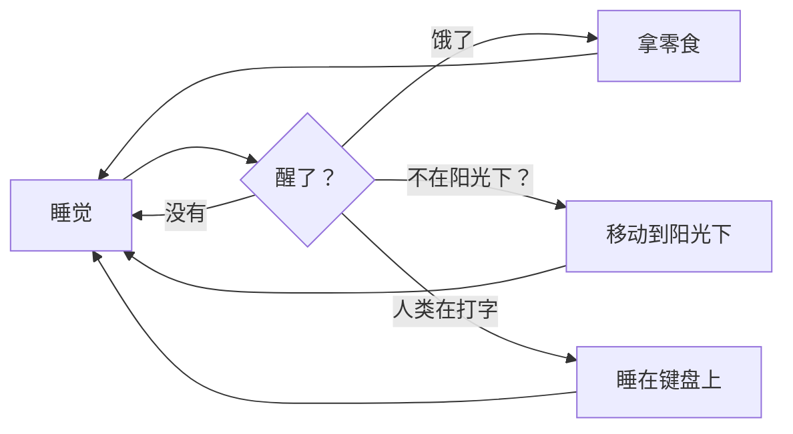

# Visual Studio Code 1.121

在 [LinkedIn](https://www.linkedin.com/showcase/vs-code)、[X](https://go.microsoft.com/fwlink/?LinkID=533687)、[Bluesky](https://bsky.app/profile/vscode.dev) 上关注我们 <!-- %IF INSIDERS % | 在 [X](https://x.com/VSCodeChangelog) 或 [Bluesky](https://bsky.app/profile/vscodechangelog.bsky.social) 上关注 Insiders 更新日志 %ENDIF % --> <!-- %IF IN_PRODUCT % | [在线查看](https://code.visualstudio.com/updates)%ENDIF % -->

---

_发布日期：2026 年 5 月 20 日_

<!-- DOWNLOAD_LINKS_PLACEHOLDER -->

---

欢迎阅读 Visual Studio Code 1.121 版本更新。此版本新增了内置的 Mermaid 和 HTML 预览功能，简化了面向智能体的终端工具行为，并支持在远程机器上运行智能体会话。

* [远程智能体](#remote-agents-preview)：从智能体窗口监控和控制远程机器上的智能体会话。

* [模型可配置性](#language-models)：配置哪些模型处理轻量级任务，如生成提交信息、标题等。

* [Mermaid 图表预览](#mermaid-diagrams-in-markdown-preview-and-notebooks)：在 Markdown 预览和 notebook 中直接渲染 Mermaid 图表。

* [HTML 文件预览](#quickly-open-html-files-in-the-integrated-browser)：无需安装扩展，即可在集成浏览器中预览本地 HTML 文件。

* [终端工具优化](#terminal)：通过更多的输出压缩和后台终端清理，减少资源消耗和 token 使用。

祝编码愉快！

---

<!-- %IF STABLE %
VS Code 正在逐步向所有用户推出。使用 VS Code 中的**检查更新**功能即可立即获取最新版本。

要尽早体验新功能，请[**下载 Nightly Insiders 版本**](https://code.visualstudio.com/insiders)，该版本包含最新更新，一旦可用即可获取。

---
%ENDIF % -->

<!-- TOC
<div class="toc-nav-layout">
  <nav id="toc-nav">
    <div>本次更新内容</div>
    <ul>
      <li><a href="#agents">智能体</a></li>
      <li><a href="#language-models">语言模型</a></li>
      <li><a href="#integrated-browser">集成浏览器</a></li>
      <li><a href="#terminal">终端</a></li>
      <li><a href="#languages">语言</a></li>
      <li><a href="#deprecated-features-and-settings">已弃用的功能和设置</a></li>
      <li><a href="#thank-you">致谢</a></li>
    </ul>
  </nav>
  <div class="notes-main">
导航结束 -->

## 智能体

### 智能体窗口（预览）

我们持续改进智能体窗口，这是在上一个版本中作为预览功能引入 VS Code 稳定版的智能体驱动型辅助窗口。

你可以通过多种方式打开智能体窗口，包括 VS Code 标题栏中的**在智能体中打开**按钮。要了解其工作原理以及可以用它做什么，请访问[智能体窗口文档](https://aka.ms/VSCode/Agents/docs)。

你的反馈对于塑造智能体体验始终是极大的帮助。如果你已经在使用它并提供反馈，谢谢你！请继续[在 GitHub 上提交问题](https://github.com/microsoft/vscode/issues)或浏览[现有问题](https://github.com/microsoft/vscode/issues?q=state%3Aopen%20label%3A%22agents-window%22)。

我们也在继续推进智能体窗口中更广泛的扩展生态建设工作，包括扩展启用所解锁的内容以及各种扩展在此环境中的行为方式。无论你是想构思利用跨项目运行智能体的新场景，还是分享你现有扩展在智能体窗口中的行为反馈，我们都期待通过 [GitHub 问题](https://github.com/microsoft/vscode/issues?q=state%3Aopen%20label%3A%22agents-window%22)与你合作。

### 远程智能体（预览）

智能体窗口现已实验性支持在你拥有且可通过 SSH 或 dev tunnel 连接的远程机器上运行智能体会话。在我们的文档中了解更多关于[远程智能体会话](https://code.visualstudio.com/docs/agents/concepts/agents#_remote-agent-sessions)的信息。


#### 连接到远程

你可以通过两种方式将智能体窗口连接到远程机器：

* **SSH**：从你现有的 `~/.ssh/config` 条目中选择，或者输入 `user@host`。
* **Dev Tunnel**：从你通过在目标机器上运行 `code tunnel` 创建的 tunnel 中选择。

#### 工作原理

此功能类似于 VS Code 的远程开发扩展，但并不相同。智能体窗口连接到远程机器，然后下载并安装 VS Code CLI（SSH）或通过你启动的 dev tunnel 连接到正在运行的 CLI 服务器。它启动一个名为"智能体主机"的轻量级进程，该进程托管一个基于 [Copilot SDK](https://www.npmjs.com/package/@github/copilot-sdk) 构建的新智能体循环。

需要注意的重要一点是，远程智能体主机是一个长寿命进程。即使你的客户端断开连接，正在运行的会话也会继续在远程机器上运行，因此你可以合上笔记本电脑，而远程智能体继续工作。

#### 智能体主机协议

智能体窗口与智能体主机之间的连接采用一种名为 **[智能体主机协议（AHP）](https://microsoft.github.io/agent-host-protocol/)** 的新型开放协议。我们正在将其作为一个独立规范进行公开开发。

AHP 的关键设计原则是它能够协调多个客户端之间同时进行的智能体会话。这与 ACP 等其他协议的不同之处在于：智能体主机管理权威状态，将其同步到每个连接的客户端，并通过纯 reducer 对所有变更进行排序。

由于 AHP 是一个开放协议，任何人都可以构建连接到 VS Code CLI 智能体主机的客户端，或者构建 VS Code 可以连接的 AHP 智能体主机。

### 使用 OpenTelemetry 和 Grafana 进行智能体可观测性

与 Azure Managed Grafana 团队合作，现在为 VS Code 中智能体发出的 OpenTelemetry 信号提供了一个预构建的 Azure Managed Grafana 仪表板。将 VS Code 指向一个转发到 Azure Application Insights 的 OTel Collector，然后导入 Azure Managed Grafana 仪表板，即可可视化智能体操作、token 使用情况、聊天会话、工具调用以及每个模型的响应时间和首 token 时间（TTFT）。

请参阅[使用 Grafana 监控 AI 编码智能体](https://learn.microsoft.com/azure/managed-grafana/grafana-opentelemetry-app-insights#github-copilot)了解端到端设置，以及[使用 OpenTelemetry 监控智能体使用情况](https://code.visualstudio.com/docs/agents/guides/monitoring-agents)了解如何从 VS Code 启用导出。


### Claude 智能体自动权限模式（预览）

**设置**：`setting(github.copilot.chat.claudeAgent.allowAutoPermissions)`

Claude 智能体现在支持[自动模式](https://code.claude.com/docs/en/permission-modes#eliminate-prompts-with-auto-mode)，允许 Claude 在没有权限提示的情况下执行操作。在执行操作之前，一个单独的分类器请求会审查这些操作，阻止任何超出你请求范围、针对未识别的基础设施或由 Claude 读取的恶意内容驱动的操作。这对于长时间运行的任务非常有用，因为你希望减少提示疲劳，同时保持后台安全检查。


要在权限模式选择器中看到自动选项，请启用 `setting(github.copilot.chat.claudeAgent.allowAutoPermissions)`。

> **注意**：如果你希望完全无人值守且无安全检查的执行（"YOLO 模式"），请启用 `setting(github.copilot.chat.claudeAgent.allowDangerouslySkipPermissions)` 以允许显示"绕过所有权限"。

## 语言模型

此版本包含多项关于如何在 VS Code 中配置和管理语言模型的改进，让你能更好地控制在不同任务中使用哪些模型。在我们的文档中了解更多关于[语言模型](https://code.visualstudio.com/docs/agent-customization/language-models)的信息。

### 配置实用模型

**设置**：`setting(chat.utilityModel)`、`setting(chat.utilitySmallModel)`

VS Code 在后台使用实用模型来处理聊天相关任务，例如生成标题、摘要、提交信息、重命名建议、提示分类和意图检测。默认情况下，这些任务使用 GitHub Copilot 提供的实用模型。

你可以使用自己可用的模型，包括自带密钥（BYOK）模型，用于这些流程：

* `setting(chat.utilityModel)`：覆盖用于一般实用流程的模型。
* `setting(chat.utilitySmallModel)`：覆盖用于快速、轻量级实用流程的模型。建议为此设置使用快速且经济的模型。

除非另行配置，否则这两个设置均使用**默认值**，即保留 GitHub Copilot 提供的实用模型。

### 用于 BYOK 的自定义端点提供程序（Insiders）

我们现在提供了一个新的 BYOK 提供程序——自定义端点提供程序，它允许你通过单一配置将任何与 Chat Completions、Responses 或 Messages 兼容的端点接入 Copilot Chat。它取代了旧版 OpenAI 兼容（`customoai`）提供程序，后者仅支持 Chat Completions，现已被标记为弃用。


从此提供程序添加模型时，你可以选择它属于哪个 API 系列（`chat-completions`、`responses` 或 `messages`）。


> **注意**：自定义端点提供程序目前为预览版，仅在 VS Code Insiders 中可用。

## 集成浏览器

### 快速在集成浏览器中打开 HTML 文件

以前，预览 HTML 文件需要安装扩展，这对于如此常见的操作来说是不必要的障碍。现在，你可以通过在文件资源管理器中右键点击文件或右键点击已打开文件的编辑器选项卡，选择**在集成浏览器中打开**选项来轻松打开本地 HTML 文件。当 HTML 文件处于活动状态时，你也可以在编辑器标题栏中选择**预览**图标。


### 改进的向聊天中添加元素的体验

我们重新设计了元素选择用户界面，以支持更丰富的功能和主题支持。

#### 选择元素范围

你现在可以点击并拖动来选择一系列元素，从而更轻松地定位共享的容器元素。

<video src="images/1_121/browser-drag-select.mp4" title="视频展示了通过点击并拖动来选择菜单中项目的祖先元素。" autoplay loop controls muted></video>

#### 从上下文菜单附加元素

你现在可以在页面中任意位置右键点击，快速将元素附加到聊天中。


## 终端

### 智能体感知的终端命令

命令行工具以前无法区分终端命令是由人类启动的还是由 VS Code 的智能体流程启动的，这意味着进度动画、交互式提示和冗长的格式可能会阻塞或干扰智能体会话。

VS Code 现在为智能体启动的终端命令设置了 `VSCODE_AGENT` 环境变量。CLI 可以检查此变量以切换到机器可读的输出、抑制进度动画或跳过可能会阻塞会话的提示。

如果你维护的脚本或 CLI 已经根据 CI 或其他智能体调整了行为，你可以对从 Copilot Chat 启动的命令使用相同的模式。

### 终端工具的后台运行指示器

以前，当聊天终端命令在工具调用返回后仍在运行时，聊天界面上看起来像是命令已经完成，使得很难判断工作仍在进行中。

工具调用现在在终端仍然活跃时显示**正在后台运行 `<command>` - 显示**。**显示**操作让你可以揭示并聚焦底层的终端。命令完成后，标题返回到正常的已完成状态。

这使得命令在后台运行时更加清晰，特别是对于异步运行或在超时后被提升为后台执行的命令。

### 后台智能体终端的清理

以前，当你有一个长时间运行的聊天会话涉及多个终端命令时，每个命令完成后可能会累积后台终端，导致终端列表中充满过时的条目并消耗资源。

VS Code 现在会自动清理由聊天智能体创建的后台终端，当它们的命令完成时释放资源，同时在聊天界面中保留命令输出。如果你使用**显示**来显示后台终端，它会保持打开状态，以便你可以继续检查或与之交互。

这保持了终端列表的整洁，并减少了多轮会话中的资源使用。

### 更广泛的终端工具输出压缩

**设置**：`setting(chat.tools.compressOutput.enabled)`

诸如 `pytest`、`jest`、`cargo test`、`tsc` 和包安装工作流等命令，在显示重要结果之前通常会产生大量的进度输出，浪费 token 并使模型更难找到相关信息。

聊天终端工具现在在将输出发送回模型之前会压缩更多类型的冗长命令输出。扩展的覆盖范围包括常见的测试运行器、构建工具、linter、Docker 命令和包管理器，因此重复的进度信息和其他低价值输出会被更频繁地裁剪。

长时间的终端运行现在更容易被模型理解和解读，并且更不可能将 token 浪费在样板输出上。

### 敏感的终端提示保留在终端中

终端命令中的密码、口令、PIN 或验证码提示可能构成风险：如果智能体试图自行处理这些提示，可能会意外地捕获或重放密钥。

当聊天终端命令遇到敏感提示时，VS Code 现在会拦截它。在默认权限模式下，聊天会显示一个确认对话框，让你聚焦到终端中直接输入密钥。在自动批准流程中，VS Code 会取消该命令并告知模型不要重试或请求密钥。

这使凭据远离聊天上下文，并防止智能体意外暴露或重放敏感输入。

## 编辑器

### 快速建议默认设置更改

Copilot 的内联建议始终与建议控件的选择保持一致。这非常有用，因为你可以快速按两次 `kbstyle(Tab)` 来同时接受建议和 Copilot 的幽灵文本。

然而，我们发现当你开始输入时，在许多情况下建议控件会弹出并选择以输入字符开头的第一个（按字母顺序排列的）可用全局符号。这很少是你实际要输入的文本，而且也会导致 Copilot 使用这个不正确的前缀给出建议，从而使体验更加嘈杂。

我们决定更改快速建议的默认设置（`setting(editor.quickSuggestions)`）。如果有内联补全提供程序（如 Copilot），则在编辑器中输入字母时不再自动触发建议控件。在所有其他情况下，建议控件会像以前一样弹出。你可以通过以下配置恢复旧行为：

```
"editor.quickSuggestions": {
  "other": "on",
  "comments": "off",
  "strings": "off"
}
```

## 语言

### Markdown 预览和 Notebook 中的 Mermaid 图表

我们已将 Matt Bierner 的 [Markdown Preview Mermaid Support](https://marketplace.visualstudio.com/items?itemName=bierner.markdown-mermaid) 扩展合并到 VS Code 中，作为一个名为 `Mermaid Markdown Features` 的新内置扩展。此扩展为 VS Code 的内置 Markdown 预览、notebook 中的 Markdown 单元格以及聊天添加了 [Mermaid 图表](https://mermaid.js.org)渲染支持。

可以在 Markdown 中使用 `mermaid` [围栏代码块](https://docs.github.com/en/get-started/writing-on-github/working-with-advanced-formatting/creating-and-highlighting-code-blocks#fenced-code-blocks)创建 Mermaid 图表：

~~~md

~~~

以下是在 Markdown 预览中图表的样子：


渲染的 Mermaid 图表还支持平移和缩放，这使得更大的图表更容易在不离开预览的情况下进行检查。你还可以右键点击图表来复制其 Mermaid 源代码。

### Markdown 预览中的 YAML frontmatter

**设置**：`setting(markdown.preview.frontMatter)`

我们添加了选项来控制如何在 Markdown 预览中渲染 [YAML front matter](https://docs.github.com/en/contributing/writing-for-github-docs/using-yaml-frontmatter)。默认情况下，VS Code 不再隐藏前言，而是在预览顶部将 front matter 显示为一个表格。


你可以使用 `setting(markdown.preview.frontMatter)` 设置来选择 front matter 的显示方式：

* `table`（默认）：将 front matter 渲染为表格。
* `codeBlock`：将 front matter 渲染为 YAML 代码块。
* `hide`：在预览中隐藏 front matter。

渲染的 frontmatter 还有一个上下文菜单条目，用于从预览中快速打开此设置。

## 已弃用的功能和设置

### 此版本中新增的弃用项

### 即将到来的弃用项


## 致谢

参与我们问题跟踪的贡献者：

* [@gjsjohnmurray (John Murray)](https://github.com/gjsjohnmurray)
* [@RedCMD (RedCMD)](https://github.com/RedCMD)
* [@IllusionMH (Andrii Dieiev)](https://github.com/IllusionMH)
* [@albertosantini (Alberto Santini)](https://github.com/albertosantini)

对 `vscode` 的贡献：

* [@ba-work (Brock Alberry)](https://github.com/ba-work): outputMonitor：修复两个导致智能体循环暂停的误报问题 [PR #315485](https://github.com/microsoft/vscode/pull/315485)
* [@guomaggie](https://github.com/guomaggie): 在代码片段水合错误时返回最终答案文本 [PR #316094](https://github.com/microsoft/vscode/pull/316094)
* [@kevin-m-kent](https://github.com/kevin-m-kent): 对重复轮询的终端输出增量进行实验 [PR #315543](https://github.com/microsoft/vscode/pull/315543)
* [@NikolaRHristov (Nikola Hristov)](https://github.com/NikolaRHristov): 修复：在测试助手中恢复 relayCreationTimeoutMs 的 protected 修饰符 [PR #316049](https://github.com/microsoft/vscode/pull/316049)
* [@SebTardif (Sebastien Tardif)](https://github.com/SebTardif): 修复监听器泄漏：将 onDidChangeConfiguration 移出 onDidProgressStep 回调 [PR #314636](https://github.com/microsoft/vscode/pull/314636)
* [@SimonSiefke (Simon Siefke)](https://github.com/SimonSiefke): 修复：lifeCycleMainService 中的内存泄漏 [PR #315891](https://github.com/microsoft/vscode/pull/315891)
* [@thernstig (Tobias Hernstig)](https://github.com/thernstig): 修复：将 typescript.tsdk.desc 替换为新的 js/ts.tsdk.path [PR #315268](https://github.com/microsoft/vscode/pull/315268)
* [@thirteenflt (yutingsun)](https://github.com/thirteenflt): 更改 vsc promptD [PR #316733](https://github.com/microsoft/vscode/pull/316733)
* [@yavanosta (Dmitry Guketlev)](https://github.com/yavanosta): 使 InlineCompletionsModel 中的 appearedInsideViewport 变为响应式 (#289944) [PR #289946](https://github.com/microsoft/vscode/pull/289946)


---

我们非常感谢大家在新功能准备就绪后立即试用，请经常回来查看以了解最新动态。

>如果你想阅读之前 VS Code 版本的发布说明，请访问 [code.visualstudio.com](https://code.visualstudio.com) 上的[更新](https://code.visualstudio.com/updates)页面。

<a id="scroll-to-top" role="button" title="返回顶部" aria-label="返回顶部" href="#"><span class="icon"></span></a>
<link rel="stylesheet" type="text/css" href="css/inproduct_releasenotes.css"/>
